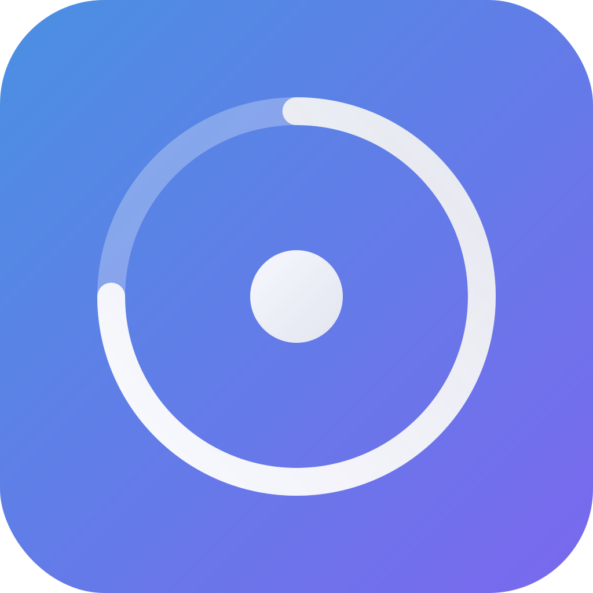

# 🎯 Focusly - Premium Pomodoro Timer for macOS

<p align="center">
  
</p>

<p align="center">
  <strong>A beautiful, feature-rich Pomodoro timer with smart calendar integration, task management, and productivity analytics</strong>
</p>

<p align="center">
  <a href="#-documentation">Documentation</a> •
  <a href="#-features">Features</a> •
  <a href="#-installation">Installation</a> •
  <a href="#-usage">Usage</a> •
  <a href="#-building-from-source">Building</a> •
</p>

---

## 🌟 Features

### Core Timer Functionality

- 🕒 **Customizable Pomodoro Timer** - Adjust work/break durations (1-120 minutes)
- 🎯 **Multiple Timer Presets** - Quick access to different work modes (Deep Focus, Quick Tasks, Creative Work)
- 🔄 **Automatic Break Management** - Smart transitions between work and break periods
- 📊 **Cycle Tracking** - Monitor your progress through multiple Pomodoro cycles
- ⏸️ **Skip Break Option** - Resume work immediately when needed

### Smart Calendar Integration

- 📅 **macOS Calendar Sync** - Real-time integration with your native calendar
- ⚠️ **Meeting Conflict Warnings** - Get notified before starting a Pomodoro that conflicts with a meeting
- 🗓️ **Optimal Focus Time Suggestions** - AI suggests best times for deep work based on your schedule
- 🔔 **Smart Notifications** - Context-aware alerts that respect your availability

### Comprehensive Task Management

- ✅ **Full Task CRUD** - Create, read, update, and delete tasks seamlessly
- 🎨 **Priority Levels** - Four priority levels (Low, Medium, High, Urgent) with visual indicators
- 📈 **Pomodoro Estimation** - Estimate and track Pomodoros per task
- 🏷️ **Task Tagging System** - Organize with custom tags
- 📅 **Due Date Management** - Set deadlines with overdue notifications
- 🎯 **Smart Task Suggestions** - AI recommends what to work on next
- 📝 **Task Notes** - Add detailed notes to any task
- 📊 **Progress Tracking** - Visual progress indicators for each task

### Advanced Statistics & Analytics

- 📈 **Detailed Statistics Dashboard** - Daily, weekly, and monthly analytics
- 🔥 **Streak Tracking** - Monitor consecutive days of productivity
- ⏱️ **Total Focus Time** - Track cumulative focused work hours
- 📊 **Productivity Heatmaps** - Visual representation of your focus patterns
- 💾 **Export Data** - Export statistics as CSV or JSON
- 🏆 **Achievement System** - Unlock achievements for productivity milestones

### Session Management

- 📝 **Session Journaling** - Add notes after completing focus sessions
- 🏷️ **Session Tagging** - Tag and categorize your work sessions
- 🔍 **Session Search & History** - Review and analyze past sessions
- 📊 **Session Analytics** - Understand which tasks take longest

### Break Time Features

- ☕ **Smart Break Activities** - Curated suggestions for effective breaks
- 👀 **Eye Care Reminders** - 20-20-20 rule implementation
- 🧘 **Stretch Prompts** - Gentle reminders to move and stretch
- 💧 **Hydration Reminders** - Stay healthy during long work sessions
- 🎨 **Full-Screen Break Overlay** - Optional immersive break experience

### User Interface & Experience

- 🎨 **Beautiful Modern Design** - Glass morphism effects and smooth animations
- 🌙 **Native Dark Mode** - Optimized for macOS appearance
- 📱 **Floating Timer Window** - Draggable, always-on-top timer display
- 🖥️ **Multi-Screen Support** - Display on all monitors or just one
- ⌨️ **Global Keyboard Shortcuts** - Control timer without opening the app
- 🎵 **Customizable Sounds** - Multiple notification sounds with volume control
- 🚀 **Minimal Menu Bar Presence** - No dock icon, clean menu bar integration
- 🔔 **macOS Notifications** - Native notification support

### Productivity Tools

- 🎯 **Timer Presets** - Save custom work/break configurations
- 📊 **Real-time Progress** - Live updates on current task progress
- 🔔 **Context-Aware Notifications** - Different notifications for work/break/session completion
- 🎨 **Dynamic Status Bar Icon** - Icon changes based on timer state
- 🚀 **Launch at Login** - Start automatically when Mac boots
- 💾 **Automatic Data Backup** - Local data persistence
- 📤 **Import/Export** - Backup and restore your data

### Privacy & Security

- 🔒 **100% Private** - All data stored locally
- 🚫 **No Tracking** - Zero analytics or telemetry
- 💾 **Local Storage** - No cloud, no accounts required
- 🔐 **Calendar Privacy** - Calendar data never leaves your device
- ⚡ **Offline First** - Works completely offline

---

## 🎮 Usage

### Quick Start

1. **Launch Focusly** - Click the timer icon in your menu bar
2. **Start Timer** - Click "Start" for a default 50-minute focus session
3. **Create Tasks** - Navigate to Tasks tab to add what you're working on
4. **Track Progress** - View Statistics tab for productivity insights

### Essential Workflows

#### Starting a Focus Session

```
1. Click menu bar icon
2. Optional: Select a task from Tasks tab
3. Optional: Choose a timer preset
4. Click "Start"
5. Focus! The app will notify you when it's break time
```

#### Managing Tasks

```
1. Click Tasks tab
2. Click "+" to add new task
3. Set priority, due date, and estimated Pomodoros
4. Start timer with task selected
5. Task automatically tracks completed Pomodoros
```

#### Customizing Timer

```
1. Click Settings gear icon
2. Adjust work duration (1-120 min)
3. Adjust break duration (1-60 min)
4. Set number of cycles (1-10)
5. Or create custom presets in Presets tab
```

### Keyboard Shortcuts

Global shortcuts work even when the app isn't focused:

| Shortcut | Action                       | Description                                 |
| -------- | ---------------------------- | ------------------------------------------- |
| `⌘⌥T`    | Start/Stop Timer             | Toggle between running and paused states    |
| `⌘⌥R`    | Reset Timer                  | Stop and reset the current timer            |
| `⌘⌥S`    | Skip Break                   | End break early and start next work session |
| `⌘⌥B`    | Toggle Floating Timer Window | Show/hide the always-on-top timer display   |
| `⌘,`     | Open Settings                | Standard macOS shortcut to open preferences |

> **Note**: These use Command+Option (⌘⌥), not Command+Shift, to avoid conflicts with system shortcuts.

### Pro Tips

1. **Enable Calendar Integration** - Grant calendar access for meeting warnings
2. **Create Custom Presets** - Save different timer configs for different work types
3. **Use Task Tags** - Organize work by project or context
4. **Review Statistics** - Check weekly stats every Sunday to plan your week
5. **Set Realistic Estimates** - Start with 1-2 Pomodoros per task until you calibrate

---

## 🛠️ Building from Source

### Prerequisites

- macOS 13.0 or later
- Xcode 14.0 or later
- Swift 5.9 or later
- Command Line Tools installed

### Development Setup

```bash
# Clone the repository
git clone https://github.com/rakesh1002/Focusly.git
cd Focusly

# Build and run
./Scripts/build_and_run.sh

# Or use Swift Package Manager directly
swift build
swift run
```

### Project Structure

```
Focusly/
├── Sources/
│   ├── FocuslyApp.swift          # Main app entry point
│   ├── Models/                    # Data models and managers
│   │   ├── TimerManager.swift     # Core timer logic
│   │   ├── TaskManager.swift      # Task management
│   │   ├── StatisticsManager.swift # Analytics
│   │   ├── CalendarManager.swift  # Calendar integration
│   │   ├── SessionJournal.swift   # Session notes
│   │   ├── NotificationManager.swift # Notifications
│   │   ├── SoundManager.swift     # Audio handling
│   │   ├── BreakActivities.swift  # Break suggestions
│   │   ├── TimerPreset.swift      # Custom presets
│   │   ├── AppSetup.swift        # First launch setup
│   │   ├── AppCleanup.swift      # Resource cleanup
│   │   └── Settings.swift         # User preferences
│   ├── Views/                     # SwiftUI views
│   │   ├── MenuBarView.swift      # Main menu interface
│   │   ├── TasksView.swift        # Task management UI
│   │   ├── StatisticsView.swift   # Analytics dashboard
│   │   ├── SettingsView.swift     # Preferences UI
│   │   ├── CalendarView.swift     # Calendar integration
│   │   ├── JournalView.swift      # Session journaling
│   │   ├── PresetsView.swift      # Timer presets
│   │   ├── BreakActivitiesView.swift # Break activities
│   │   └── AboutView.swift        # About window
│   ├── Windows/                   # Custom windows
│   │   ├── TimeDisplayWindow.swift # Floating timer
│   │   ├── BreakOverlayWindow.swift # Break screen
│   │   └── WindowManager.swift    # Window management
│   └── Utilities/                 # Helper classes
│       ├── ColorTheme.swift       # Color system
│       ├── GlassStyle.swift       # Glass morphism
│       ├── KeyboardShortcutManager.swift # Global shortcuts
│       ├── PermissionManager.swift # System permissions
│       └── AppUserDefaults.swift  # Persistent storage
├── Tests/                        # Unit tests
├── Package.swift                 # Swift Package Manager config
├── Focusly.entitlements         # App entitlements
├── AppIcon.svg                   # App icon source
└── README.md                     # This file
```

### Running Tests

```bash
swift test

# With coverage
swift test --enable-code-coverage
```

---

## 🚀 Feature Roadmap

### v1.1 (Next Release)

- [ ] Menu bar timer display
- [ ] Quick task creation from main view
- [ ] Export tasks as Markdown
- [ ] Custom notification sounds
- [ ] Statistics comparison view

### v1.2

- [ ] Focus Mode integration
- [ ] Desktop widgets
- [ ] Sound library (ambient sounds)
- [ ] Advanced filtering in tasks
- [ ] Dark/Light theme customization

### v1.3

- [ ] Cloud sync (optional paid feature)
- [ ] Collaboration features
- [ ] Apple Watch companion
- [ ] Shortcuts integration

### v2.0

- [ ] AI task prioritization
- [ ] Mobile companions
- [ ] Team features
- [ ] Advanced automation

---

## 🤝 Contributing

Contributions are welcome! Please feel free to submit a Pull Request.

### Development Guidelines

1. **Fork the repository**
2. **Create a feature branch** (`git checkout -b feature/AmazingFeature`)
3. **Follow Swift style guide** (SwiftLint configured)
4. **Write tests** for new features
5. **Update documentation** as needed
6. **Commit your changes** (`git commit -m 'Add some AmazingFeature'`)
7. **Push to the branch** (`git push origin feature/AmazingFeature`)
8. **Open a Pull Request**

### Code Style

- Follow Apple's Swift API Design Guidelines
- Use meaningful variable and function names
- Comment complex logic
- Keep functions focused and small
- Write unit tests for business logic

---

## 📄 License

This project is licensed under the MIT License - see the [LICENSE.txt](LICENSE.txt) file for details.

## 🙏 Acknowledgments

- **Design Inspiration**: Apple's Human Interface Guidelines
- **Pomodoro Technique**: Francesco Cirillo
- **Icons**: SF Symbols by Apple
- **Community**: Thanks to all beta testers and contributors
- **Libraries**: Built with native SwiftUI and AppKit

---

## 📞 Support & Contact

- **Email**: support@focusly.unquest.ai
- **Website**: https://focusly.unquest.ai
- **Twitter**: @FocuslyApp
- **GitHub Issues**: [Report bugs and request features](https://github.com/rakesh1002/Focusly/issues)

---

<p align="center">
  <strong>Built with ❤️ by Rakesh</strong>
  <br>
  <sub>Focus better. Work smarter. Achieve more.</sub>
</p>

<p align="center">
  <a href="https://buymeacoffee.com/buildwithrakesh">☕ Buy me a coffee</a>
</p>
